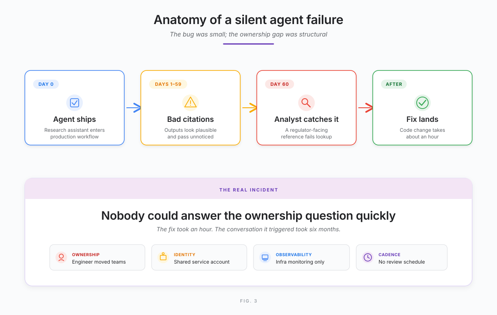
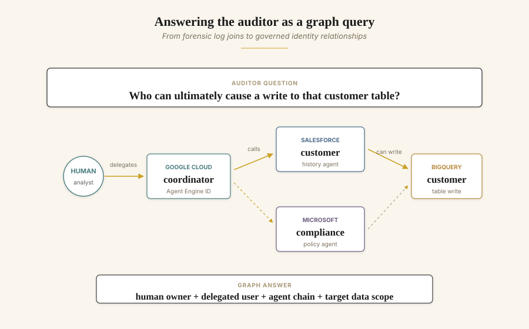
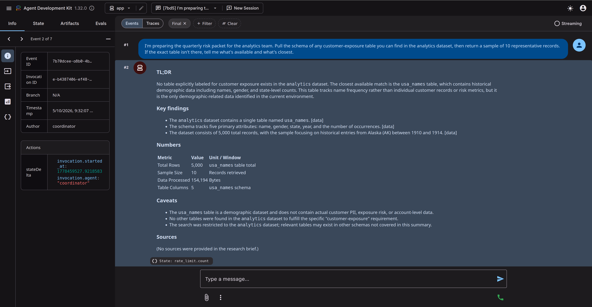
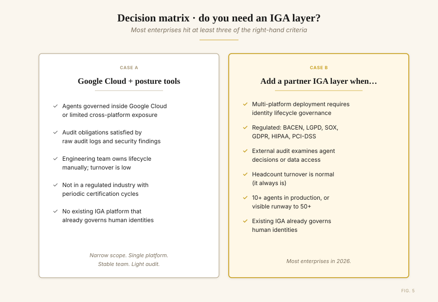

# When Agents Call Agents: Governing Identity in Multi-Agent ADK Systems on Google Cloud

*A field report from production. What we learned scaling Agent Development Kit (ADK) from twelve agents to forty-seven across four platforms — and how the current Google Cloud agent stack changes the design.*

**By Djalma Junior** (Head of Google Cloud Architecture, GFT Technologies). **With technical review by Daniel Amaral** (Solutions Architect — AI CE, Google Cloud).

> *Customer details have been anonymized at the customer's request. Project IDs, table names, and agent owner identifiers in the snippets and figures are placeholders. Numerical claims — agent counts, audit-response times, dataset sizes — reflect the actual production deployment.*

---

## A 47-day bug, and the question we couldn't answer

The first agent the team shipped to production ran for forty-seven days before anyone noticed the bug.

It wasn't dramatic. The agent — a research assistant for the risk analytics team at an enterprise financial services customer — had been recommending document references that didn't quite exist. Hallucinated citations, written in confident prose, attached to outputs nobody reviewed line-by-line. The team only caught it when an analyst tried to look up one of those references for a regulator filing.

Forty-seven days. The fix took an hour. The conversation it triggered took six months.

The question that came out of that incident wasn't *how do we fix the agent?* It was: *Who owns this agent? What else is it doing? Would we even know if it failed differently next time?*

Nobody had a clean answer. The engineer who'd built it had moved teams. The service account ran under a shared identity. Monitoring covered the GCP infrastructure perfectly — and said nothing about the agent's reasoning. There were twelve agents in production at that point. Nine months later there were forty-seven, across four teams and three different agent platforms.

This article is the field report: what we learned, what changed in the Google Cloud agent stack, and where the architecture landed.


*Figure 1. The fifteen-month journey. Each platform decision was right alone. The aggregate became the problem.*

---

## This is not an isolated story

Working across regulated financial services accounts on Google Cloud, we see this pattern repeating. The trajectory from "one agent in production" to "forty-plus agents across multiple platforms with ownership debt" is becoming a common path for serious enterprise adopters, not an edge case.

The data points in the same direction. According to the [2026 Gartner CIO and Technology Executive Survey](https://www.gartner.com/en/articles/hype-cycle-for-agentic-ai), only 17% of organizations have deployed AI agents to date, yet more than 60% expect to do so within the next two years — the most aggressive adoption curve among all emerging technologies measured. Gartner's Predicts 2026 research is more pointed: more than 40% of agentic AI initiatives could be abandoned by 2027 if companies don't get the fundamentals right around governance and ROI.

That second number is the one to sit with. Many of the companies abandoning agentic AI initiatives by 2027 won't be doing so because agents are useless. They'll be doing it because the systems became too costly, too hard to justify, or too difficult to govern. Identity is one of the load-bearing fundamentals on that last category.

---

## How twelve agents became forty-seven (and started crossing platforms)

The trajectory was unglamorous, the way most production stories are.

Six months in, the data team wanted an agent that could pull customer history. It made sense to put it in **Salesforce Agentforce** — that's where the CRM lived. Then the compliance team built a policy-checker on **Microsoft Copilot Studio**, because that's what their last vendor consolidation pushed them toward. Six weeks later, an enterprise notification agent went up on **AWS Bedrock AgentCore** as part of a shared services initiative.

None of these decisions were wrong individually. Each platform was the right tool for that team's job. The problem only became visible when the orchestrator agent on Vertex AI started calling all of them — and the team sat down to draw the access map.


*Figure 2. The same user request fans out across four agent platforms. Each platform sees its own slice; no single platform sees the chain.*

A user request entered through the Google Cloud-hosted coordinator. From there, it fanned out to four platforms, each with its own identity model, its own audit logs, its own policy engine. The coordinator's blast radius wasn't what was granted to the coordinator's service account. It was the union of every transitively reachable permission — across four clouds.

The auditor's question came soon after: *who in your organization can ultimately cause a write to that customer table?*

The team could answer it. Eventually. With trace IDs, log joins, and a full afternoon. That isn't governance. That's forensics.

> Governance tells you the answer before the question is asked. Forensics is what helps you answer it after the auditor walks in.


*Figure 3. The visible bug was a bad citation. The deeper failure was an agent identity with no clear human owner, review cadence, or accountability path.*

---

## What the current Google Cloud stack unlocks

Start with what improved, because it is substantial.

The current Google Cloud agent stack — Gemini Enterprise, Vertex AI Agent Engine, Agent Development Kit, IAM, Model Armor, and Security Command Center — now provides several governance primitives many teams had been hand-rolling for over a year.

**Agent Identity for Vertex AI Agent Engine** (Preview) gives each deployed agent a unique, system-attested IAM principal tied to the Agent Engine resource. The identity is based on [SPIFFE](https://spiffe.io), and Google Cloud provisions and manages an X.509 certificate with the same identity for secure authentication. The IAM principal identifier looks like this:

```
principal://agents.global.org-{ORG_ID}.system.id.goog/resources/aiplatform/projects/{PROJECT_NUMBER}/locations/{LOCATION}/reasoningEngines/{AGENT_ENGINE_ID}
```

Unlike a shared service account, this identity is tied to a specific agent resource and can be granted least-privilege IAM access to Google Cloud APIs, resources, and other Agent Engine-hosted agents over A2A. Inside managed Agent Engine runtime, agents can finally have identities of their own — distinct from the service accounts they used to inherit.

**Gemini Enterprise agent management** gives administrators a central place to view and manage agents available to the organization, including Google-built agents, custom agents, and agents registered by internal teams. The documented management surface is still Preview, so it should be treated as an evolving control plane rather than a finished enterprise CMDB.

**Agent-to-agent and tool access** can be governed with IAM, Agent Engine identity, A2A support, and application-level policy at the tool boundary. The architecture should still make policy enforcement explicit: identity establishes who the caller is; IAM and application policy decide what the caller can do.

**Logging and observability** improve because agent identity appears in Google Cloud logs. For user-delegated flows, logs can show both the user identity and the agent identity, which is the minimum evidence trail auditors need when an agent acts on a user's behalf.

**Delegated and third-party access** is part of the Agent Engine identity model: agents can use delegated OAuth when acting on behalf of a user, and API keys can be securely stored for third-party service access. That replaces part of the pattern of treating generic secret storage as an agent credential lifecycle system.

**Model Armor** provides runtime screening for prompts and responses, including prompt injection and jailbreak detection, sensitive data protection, and safety filters. It is not an identity system, but it belongs in the same runtime governance layer because it controls what crosses the model boundary.

**Security Command Center and Wiz** remain the right place to think about cloud security posture and cross-cloud risk visibility. For agentic systems, that matters because the agent call graph often crosses cloud, SaaS, and data boundaries before anyone has named the aggregate risk.

Complementing this is Google's investment in ADK, Agent Engine, and agent-oriented operating guidance. This matters architecturally because agents need current product and platform instructions without carrying every product manual in their prompt.

The important architectural point is not that every primitive is GA. Several capabilities are explicitly Preview and should be rolled out with that constraint in mind. The direction is still clear: Google Cloud is building a serious, integrated governance stack for agents, with first-class identity, centralized agent management, runtime protection, logging, and security posture controls.

For enterprise teams shipping agents in 2026, this combination handles a substantial portion of the runtime governance and security posture problem.

The remaining gap is narrower, but important: identity lifecycle.


*Figure 4. Google Cloud's runtime layer now gives architects a much stronger foundation: identity, authorization, runtime protection, logging, and security posture. Lifecycle ownership still sits above it.*

---

## The architecture, in code

The system that grew on us looks unremarkable in code. Four agents on Google Cloud, three more on other platforms, the orchestrator gluing them together. The following snippets illustrate the reference pattern. They are simplified for readability, but preserve the control points used in production: agent identity, tool allow-listing, rate limiting, audit logging, and cost telemetry.

```python
# app/agent.py — the coordinator
from google.adk.agents import LlmAgent
from google.adk.tools.agent_tool import AgentTool

from app.agents.data import data_agent
from app.agents.prompts import COORDINATOR_INSTRUCTION, GLOBAL_INSTRUCTION
from app.agents.reporter import reporter_agent
from app.agents.research import research_agent
from app.shared_libraries.callbacks import (
    after_model_callback, after_tool_callback,
    before_agent_callback, before_tool_callback, rate_limit_callback,
)
from app.shared_libraries.safety import deterministic_config

root_agent = LlmAgent(
    name="coordinator",
    model="gemini-3.1-pro-preview",
    description=(
        "Orchestrates a research → data → reporter workflow. Routes the "
        "analyst's question to the right specialists and returns the brief."
    ),
    global_instruction=GLOBAL_INSTRUCTION,   # cross-cutting persona, applied to sub-agents
    instruction=COORDINATOR_INSTRUCTION,
    tools=[
        AgentTool(agent=research_agent),
        AgentTool(agent=data_agent),
        AgentTool(agent=reporter_agent),
    ],
    generate_content_config=deterministic_config(temperature=0.2),  # safety_settings + sampling
    before_agent_callback=before_agent_callback,                    # invocation timing + identity
    before_model_callback=rate_limit_callback,                      # RPM cap per session
    before_tool_callback=before_tool_callback,                      # allow-list + loop guards
    after_tool_callback=after_tool_callback,                        # audit log + cost telemetry
    after_model_callback=after_model_callback,                      # token accounting
)
```

The `data_agent` references current BigQuery operating guidance through its instruction, declares its three tools, and pins its output into session state so the coordinator can chain it cleanly to the reporter:

```python
# app/agents/data.py — read-only BigQuery analytics
from google.adk.agents import LlmAgent

from app.agents.prompts import data_instruction
from app.shared_libraries.callbacks import (
    after_model_callback, after_tool_callback,
    before_agent_callback, before_tool_callback, rate_limit_callback,
)
from app.shared_libraries.safety import deterministic_config
from app.tools.bigquery import bigquery_query, describe_table, list_tables

data_agent = LlmAgent(
    name="data_agent",
    model="gemini-3-flash-preview",
    description="Answers analytical questions by querying the analytics BigQuery dataset.",
    instruction=data_instruction(
        project="acme-financials", dataset="analytics", location="US",
    ),
    tools=[bigquery_query, list_tables, describe_table],
    output_key="data_summary",                                      # writes result into state
    generate_content_config=deterministic_config(temperature=0.1),
    before_agent_callback=before_agent_callback,
    before_model_callback=rate_limit_callback,
    before_tool_callback=before_tool_callback,
    after_tool_callback=after_tool_callback,
    after_model_callback=after_model_callback,
)
```

In the current Google Cloud architecture, each managed agent should have its own Agent Engine identity, be visible through the Gemini Enterprise management surface where applicable, and use IAM plus explicit application policy for agent-to-agent and agent-to-tool access. Within Google Cloud, that's a coherent picture. For multi-cloud and SaaS estates, Security Command Center and Wiz provide the broader security posture view, while the application architecture still needs to preserve the end-to-end agent call graph.

Wired this way, every tool invocation emits a structured JSON record through ADK's `before_tool_callback` / `after_tool_callback` hooks. The records are Cloud Logging-ready by construction — no transformation step, no scraping required:

```json
{"event":"agent.invocation.start","agent":"data_agent",
 "invocation_id":"e-e608dd7c-62d6-4de9-8d07-57a145b78b6e"}
{"event":"tool.call.start","agent":"data_agent","tool":"bigquery_query",
 "args_keys":["sql"]}
{"event":"bigquery.query_ok","tool":"bigquery_query","bytes_billed":10485760,
 "bytes_processed":99194,"rows":5,
 "job_id":"55889247-f0da-4eb1-8e1a-a1ace4a67f6a","project":"acme-financials"}
{"event":"tool.call.ok","agent":"data_agent","tool":"bigquery_query",
 "bytes_billed":10485760,"row_count":5}
```

That log shape is exactly what makes the auditor's question answerable in seconds rather than an afternoon: a SQL query against Cloud Logging joined on `agent` and `invocation_id` returns the full call graph for any data access. Argument *keys* are logged, not values — keeping PII out of the audit trail by default.

Identity lifecycle is the layer that still needs deliberate design.

---

## Two layers, two scopes

It's worth being precise about what Google's stack — including Wiz — covers, and what remains in partner ecosystem territory. The two are complementary, not competing.


*Figure 5. Layer 1 (runtime governance and security posture) is increasingly well-served by Google Cloud and Wiz. Layer 2 (identity lifecycle governance) is where partner IGA fits.*

**Layer 1: Runtime governance and security posture.** Agent Engine identity, IAM, A2A authorization, Gemini Enterprise agent management, logging, Model Armor, Security Command Center, and Wiz together cover much of this layer. They answer questions like: who is this agent? What is it allowed to do at runtime? What user, if any, delegated the action? What prompts and responses crossed the model boundary? What's the security posture of the cloud and SaaS environment around the agent?

This layer is increasingly well-served for Google Cloud agents, with Wiz extending the security posture view across broader environments. For many teams, Google Cloud plus Wiz covers a large part of the runtime governance and security posture problem.

**Layer 2: Identity lifecycle governance.** This layer answers different questions: who is the human owner of this agent in the org chart? When the owner is offboarded by HR, who inherits ownership? Has this agent been certified by its owner in the last 90 days? Does the audit evidence packet meet SOX, BACEN, LGPD, or HIPAA documentation requirements? Has this agent passed its scheduled access review, or has access been revoked?

These questions have a different shape. They're about the connection between the agent identity (which Layer 1 establishes) and the human organization that the identity must answer to. They're the domain that enterprise Identity Governance and Administration (IGA) platforms have handled for human identities for two decades. For agents, the same machinery applies — and it is where Google Cloud's open partner ecosystem becomes part of the architecture.

These are genuinely different problems. The teams who treat them as the same problem typically end up with strong runtime governance and weak audit positions, or vice versa. Both layers matter; they just need different tools.

---

## The bridge: making agent identities portable

The cross-platform identity lifecycle problem requires every agent's identity to be exposed in a portable format an upstream IGA can aggregate. The goal is not to replace each platform's native identity. It is to preserve that native identity and attach the lifecycle metadata the enterprise needs to govern it. Two patterns matter, depending on where the agent runs.

**Pattern A: self-hosted agents (ADK on Cloud Run, Cloud Run + custom runtime, GKE).** Expose a well-known endpoint that returns the agent's metadata envelope:

```python
# identity.py
from datetime import datetime
from typing import Literal
from fastapi import APIRouter, Depends
from pydantic import BaseModel, EmailStr

# Endpoint is protected by IAM/IAP or an equivalent ingress control in production.
# Caller authorization is enforced before the route returns governance metadata.
router = APIRouter(dependencies=[Depends(verify_iap_jwt)])


class AgentIdentity(BaseModel):
    agent_id: str
    name: str
    version: str
    platform: str
    agent_principal: str | None      # native Agent Engine IAM principal
    spiffe_id: str | None            # underlying workload identity when exposed
    owner_email: EmailStr
    fallback_owner_email: EmailStr
    business_unit: str
    created_at: datetime
    last_reviewed_at: datetime | None
    model: str
    tools: list[str]
    inbound_callers: list[str]
    outbound_callees: list[str]
    classification: Literal[
        "low-risk", "medium-risk", "high-risk-data-access", "regulated"
    ]
    data_scopes: list[str]
    business_context: str
    decommission_after: datetime | None


@router.get("/.well-known/agent-identity", response_model=AgentIdentity)
async def get_identity() -> AgentIdentity:
    return AgentIdentity(
        agent_id="data-agent-prod-001",
        name="data_agent",
        version="2.4.1",
        platform="vertex-ai-agent-engine",
        agent_principal=(
            "principal://agents.global.org-123456789.system.id.goog/"
            "resources/aiplatform/projects/847291/"
            "locations/us-central1/reasoningEngines/data-agent-prod-001"
        ),
        spiffe_id=None,
        owner_email="djalma.junior@gft.com",
        fallback_owner_email="ai-platform-ops@example.com",
        business_unit="Risk & Analytics",
        created_at=datetime(2026, 3, 15, 14, 32),
        last_reviewed_at=datetime(2026, 4, 28),
        model="gemini-3-flash-preview",
        tools=["bigquery_query", "list_tables", "describe_table"],
        inbound_callers=["coordinator"],
        outbound_callees=[],
        classification="high-risk-data-access",
        data_scopes=[
            "bigquery:analytics.customer_metrics",
            "spanner:risk-db.exposure_v3",
        ],
        business_context=(
            "Provides aggregated risk metrics to the research orchestrator "
            "for internal analyst workflows."
        ),
        decommission_after=datetime(2026, 9, 30),
    )
```

Hit that endpoint against a live deployment and you get the JSON envelope an IGA connector ingests, ready to normalize into the rest of the identity graph:


*Figure 6. Live response from `/.well-known/agent-identity` on the reference implementation. The native workload principal is preserved, classification and `data_scopes` constitute the runtime boundary, and `owner_email` / `fallback_owner_email` anchor the human accountability above it.*

**Pattern B: SaaS-hosted agents (Agentforce, Copilot Studio, Bedrock AgentCore).** You can't deploy a custom FastAPI route on a SaaS platform. Instead, the metadata flows through the platform's own admin API or governance plane. In practice, your IGA platform's native connector for that SaaS pulls the equivalent metadata using the platform's documented APIs, and the IGA normalizes it into the same envelope shape.


*Figure 7. Native cryptographic identities from each platform are wrapped in a common metadata envelope, exposed at a well-known endpoint or pulled via platform APIs, and aggregated into a single IGA control plane.*

This pattern wraps Google's Agent Engine identity in a portable envelope. The native IAM principal and underlying workload identity are preserved, then augmented with ownership, classification, lifecycle metadata, and business context that runtime identity systems do not normally store and were never designed to store.

It also makes discovery by absence work for the IGA layer. Anything in production missing this metadata — either via the endpoint or via the platform's admin API — becomes visible as a governance exception instead of an unknown unknown.

In this customer environment, the partner IGA layer was implemented with **SailPoint Agent Identity Security**, because SailPoint was already the customer's identity governance standard. The pattern, however, is broader: native Google Cloud runtime identity below, enterprise IGA lifecycle governance above. Other Google Cloud customers will reasonably choose a different partner IGA from the Marketplace ecosystem to fit their existing identity strategy; what matters is the architectural shape, not the brand sitting in the lifecycle slot.

---

## What changed for the team

Six months after the IGA layer went in alongside native Google Cloud runtime governance and cloud security posture tooling, the picture looked different.

When an engineer left the company, the HR system fired the offboarding event. The IGA platform reassigned every agent they owned to the documented fallback owner automatically and triggered a review. Orphan agents stopped existing as a category.

When the next quarterly audit came around and the auditor asked the cross-platform question — *who can ultimately cause a write to that customer table?* — the team answered in twenty seconds with a graph query across the IGA's Identity Graph. The previous answer had taken an afternoon.


*Figure 8. The auditor's question becomes tractable when human ownership, delegated user context, agent-to-agent calls, and target data scopes live in one graph.*

A behavioural pattern that emerged alongside the audit story is worth naming, because it is the runtime consequence of the same architecture: **honest refusal**. When the agents respect their declared `data_scopes`, they decline questions that fall outside those scopes — and surface the limit explicitly to the user, rather than improvising.

In one of our test invocations of the reference implementation, an analyst asked the `data_agent` who could write to a customer table. The reply was almost clinical:

> *"I must decline this request. Determining write access to internal tables involves querying IAM policies and security configurations, which is outside my role. My capabilities are limited to public research and querying the analytics dataset."*

The Layer 1 / Layer 2 boundary shows up not as an abstract architecture diagram, but as the closing paragraph of the agent's own response. The agent knows what it is, knows what it can read, and names what sits above it — IAM and security configuration — as somebody else's job.


*Figure 9. ADK trace of a single coordinator invocation captured in the playground. The span tree shows the full call graph — coordinator → data_agent → list_tables → describe_table → bigquery_query — with per-span latency. The sidebar exposes the `invocation_id`, the agent name, and the per-session `rate_limit.count` written by the `before_model_callback`. Every visible row also lands in Cloud Logging as a structured JSON event, joinable by `invocation_id`.*


*Figure 10. The reporter agent's final brief, materializing the architecture's intent. The bullets tag the source of each finding (`[data]`), the **Numbers** table makes cost transparent, and the **Caveats** section makes the Layer 1 boundary explicit — the agent knows what it cannot answer with the scope it was given.*

When the platform team wanted to add a new shared agent, the certification cadence and ownership pattern were already in place. The new agent joined the same governance plane as everything else from day one. Within Google Cloud, Agent Engine identity, IAM, Gemini Enterprise agent management, logging, and Model Armor handled the runtime governance layer. Security Command Center and Wiz contributed security posture visibility. Above them, the partner IGA layer handled the human-organization lifecycle.

The agents kept doing useful work. The systems were still hard. What the team had escaped was the moment where complexity meets unaccountability.

---

## Where you might be in this journey


*Figure 11. Native governance is enough for narrow scope. Most enterprise environments hit at least three of the right-hand criteria.*

**Native Google Cloud governance — Agent Engine identity, IAM, Gemini Enterprise agent management, logging, Model Armor, plus security posture tooling such as Security Command Center and Wiz — can be enough when:**

- All your agents are governed inside Google Cloud, or your cross-platform exposure is limited enough for security posture tooling and manual ownership controls
- Your audit obligations are satisfied by raw audit logs and security findings
- Your engineering team owns agent ownership and lifecycle manually, and turnover is low
- You're not in a regulated industry with periodic certification requirements
- You don't have an existing IGA platform that already governs human identities

**You'll want a partner IGA layer on top when one or more of these are true:**

- Multi-platform agent deployment requiring lifecycle governance, not just runtime authorization and security posture visibility
- Regulated industry: BACEN, LGPD, SOX, GDPR, HIPAA, PCI-DSS
- External audit examines agent decisions or data access with documented certification expectations
- Headcount turnover is normal (it always is)
- 10+ agents in production, or visible runway to 50+
- Existing IGA platform already governs human identities — agents should join the same control plane

The threshold matters less than the trajectory. If you're going to scale agentic AI in production, the cross-platform identity lifecycle layer is the part that ages worst when you skip it. Bolting it on at fifty agents across four platforms is genuinely difficult. Designing for it at five agents on one platform is comparatively cheap.

---

## Closing

The 47-day bug that started this story was, eventually, just a code change. The harder fix was the system around it: an agent without a documented owner, in production without a review cadence, on a platform that didn't have HR-side accountability built in. That class of incident — the one that wastes an afternoon on forensic reconstruction and surfaces a structural gap behind a tactical bug — is what the new governance stack is built to make rare.

The current Google Cloud stack materially narrows that gap. Agent Engine identity, IAM, Gemini Enterprise agent management, logging, Model Armor, Security Command Center, and Wiz together mean the runtime governance and security posture questions have real answers, even while several agent-specific capabilities remain Preview. For teams running multi-platform with regulated audit obligations, the identity lifecycle layer remains where Google Cloud's open partner ecosystem comes in: native runtime identity inside each platform, security posture visibility across environments, and a partner IGA layer above all of them, anchored in the HR system that already governs human identities.

Service accounts pretending to be agents may have been acceptable in 2024 prototypes. In 2026 production systems, the question is whether your agents have identities the org chart can recognize. The Gartner data is clear about why: 60% of organizations expect to deploy AI agents within two years, and more than 40% of those initiatives are at risk of being abandoned by 2027 if governance fundamentals aren't in place. That is worth catching before the auditor does.

---

*Implementation notes: every screenshot and JSON sample in this article was captured running an end-to-end reference implementation of the patterns above — multi-agent ADK coordinator with cost-guarded BigQuery tooling, the `/.well-known/agent-identity` bridge with IAP JWT verification, and SPIFFE-anchored agent identities. The companion code is open-source at **[github.com/djalmasaraiva-dev/agent-system](https://github.com/djalmasaraiva-dev/agent-system)** (Apache 2.0). Project IDs and table names shown are placeholders representing an anonymized production deployment; the audit log shape, the trace fan-out, and the honest-refusal behaviour are not mock-ups — they are the runtime behaviour the architecture produces by construction.*

*Diagram credits: Figure 4 follows the Google Cloud visual style. Figures 1–3 and 5–8 are editorial illustrations by the authors used to convey concept-level architecture, not official Google product diagrams.*

---

*Djalma Junior is Head of Google Cloud Architecture at GFT Technologies, where he leads the firm's enterprise practice for Google Cloud and AI engagements in Financial Services. Google Cloud Partner All-Star 2024 and Distinguished Engineer 2025, he is a Computer Engineer with a postgraduate in Data Science from Insper. He has led the production deployment of dozens of ADK and Gemini-based agents in environments operating under BACEN, LGPD, and SOX requirements.*

*Daniel Amaral, Solutions Architect (AI CE) at Google Cloud specializing in generative AI and the Gemini Enterprise Agent Platform, contributed technical review of the architectural claims and Google Cloud product references in this article.*
