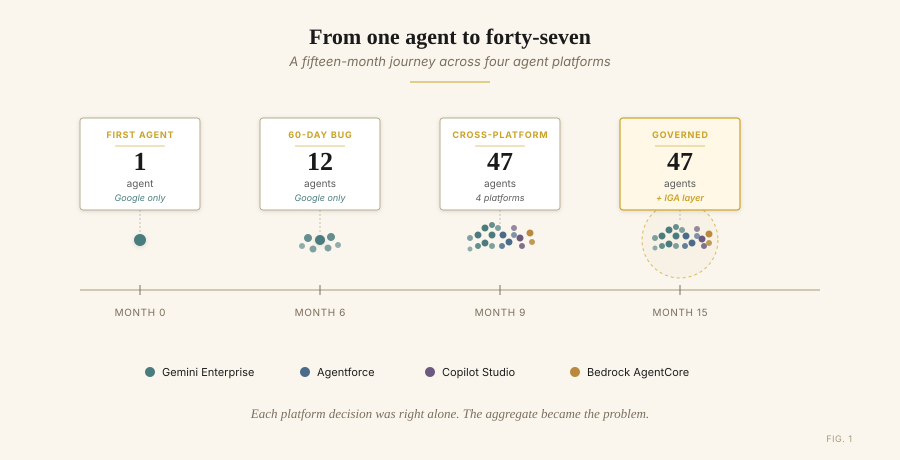
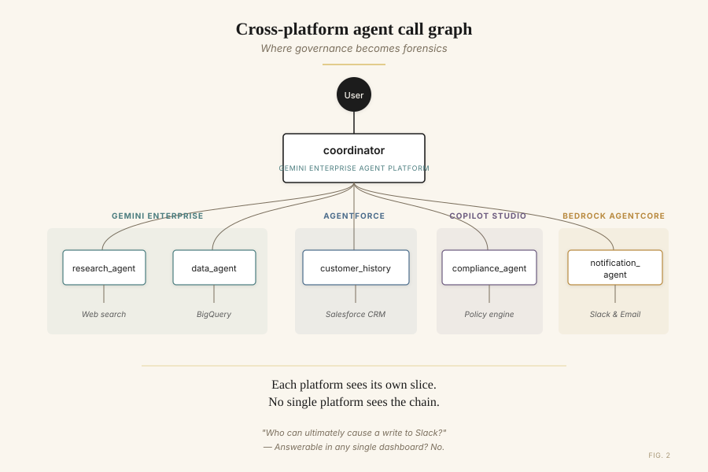
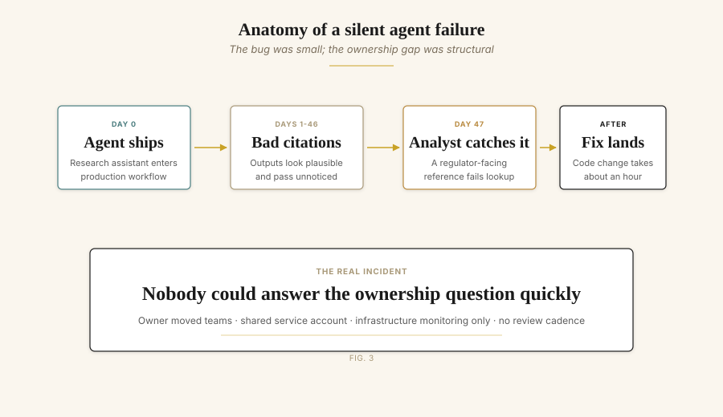
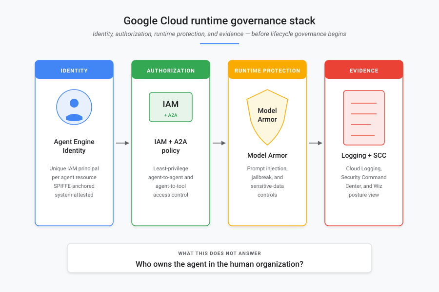
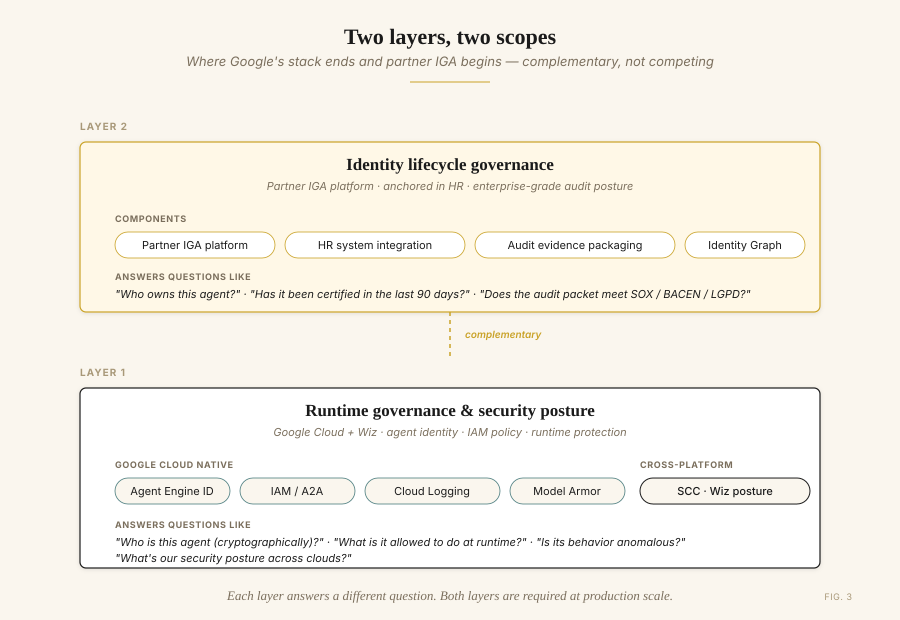
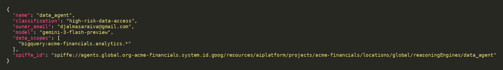
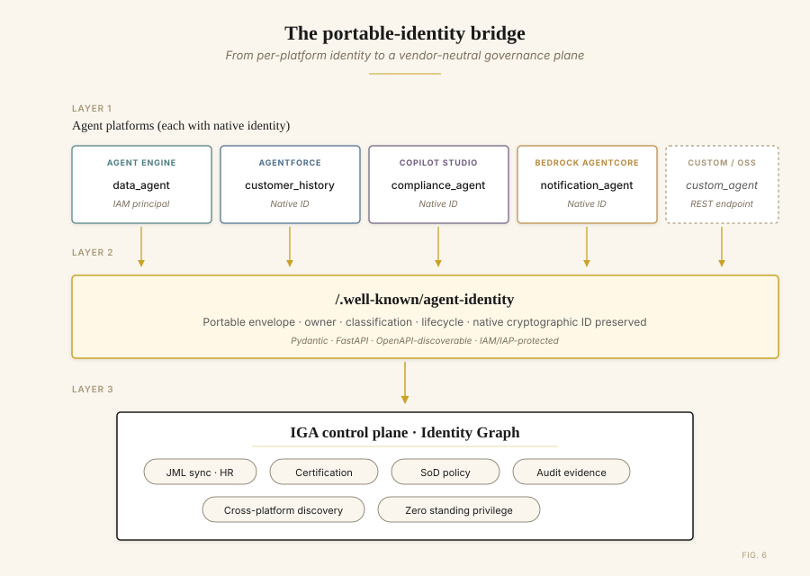
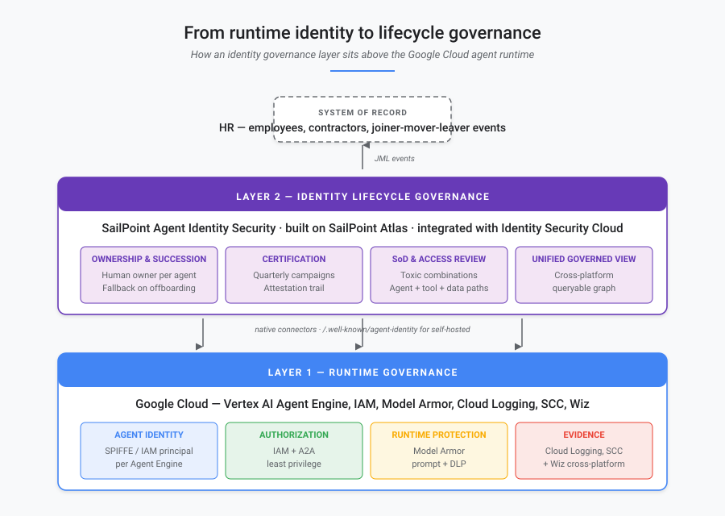
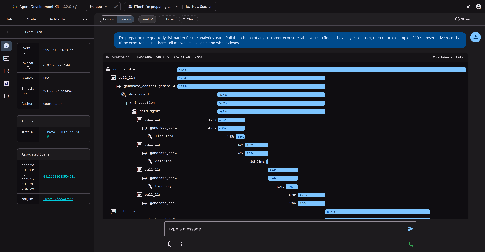

# When Agents Call Agents: An Identity Governance Field Report from Production

*What we learned scaling 12 ADK agents to 47 across four platforms — and why the real bottleneck wasn't the agents. It was their identities.*

**By Djalma Junior** (Head of Google Cloud Architecture, GFT Technologies).

> *This article synthesizes patterns I have observed across multiple Financial Services engagements with ADK and Gemini-based agentic systems on Google Cloud. Project IDs, table names, and agent owner identifiers in the snippets and figures are placeholders. Numerical claims — agent counts, audit-response times, dataset sizes — are representative of those engagements rather than a single customer.*

---

## A 47-day bug, and the question we couldn't answer

The first agent we shipped to production ran for forty-seven days before anyone noticed the bug.

It wasn't dramatic. The agent — a research assistant for the risk analytics team at an enterprise financial services customer — had been recommending document references that didn't quite exist. Hallucinated citations, written in confident prose, attached to outputs nobody reviewed line-by-line. The team only caught it when an analyst tried to look up one of those references for a regulator filing.

Forty-seven days. The fix took an hour. The conversation it triggered took six months.

The question that came out of that incident wasn't *how do we fix the agent?* It was: *Who owns this agent? What else is it doing? Would we even know if it failed differently next time?*

Nobody had a clean answer. The engineer who'd built it had moved teams. The service account ran under a shared identity. Our monitoring covered the GCP infrastructure perfectly — and said nothing about the agent's reasoning. We had twelve agents in production at that point. Nine months later we had forty-seven, across four teams and three different agent platforms.

This is the field report. What we learned about scaling agentic systems, what changed in the Google Cloud agent stack, and — the part most architects haven't internalized yet — why the identity governance layer above the runtime is where production agentic systems actually live or die.


*Figure 1. The fifteen-month journey. Each platform decision was right alone. The aggregate became the problem.*

---

## The data point I can't unsee

When I sit with peers running agentic systems at scale, two numbers anchor every conversation.

The first is Gartner's. According to the [2026 CIO and Technology Executive Survey](https://www.gartner.com/en/articles/hype-cycle-for-agentic-ai), only 17% of organizations have deployed AI agents to date, yet more than 60% expect to do so within the next two years — the most aggressive adoption curve among all emerging technologies measured. Gartner's Predicts 2026 research is sharper: more than **40% of agentic AI initiatives could be abandoned by 2027** if companies don't get the fundamentals right around governance and ROI.

The second is from the [SailPoint and Dimensional Research survey](https://www.sailpoint.com/press-releases/sailpoint-ai-agent-adoption-report) "AI agents: the new attack surface" (May 2025), based on 353 technology professionals across five continents. The headline numbers: **80% of organizations had already seen AI agents take unintended actions, 92% state that governing AI agents is critical to security, and 96% view AI agents as a growing security threat**. Even more telling: **72% say AI agents pose a greater risk than traditional machine identities**. Those numbers match what I have been seeing in regulated financial services for the past two years.

The companies abandoning agentic AI initiatives by 2027 won't be doing so because the agents don't work. They'll be doing it because the systems became too costly, too hard to justify, or — most often, in my experience — **too difficult to govern**.

Identity is the load-bearing fundamental on that last category. The seams across platforms are where most of the unintended actions happen. Every agent that doesn't have a clear human owner is a future incident waiting for an auditor.

---

## How twelve agents became forty-seven (and started crossing platforms)

The trajectory was unglamorous, the way most production stories are.

Six months in, the data team wanted an agent that could pull customer history. It made sense to put it in **Salesforce Agentforce** — that's where the CRM lived. Then the compliance team built a policy-checker on **Microsoft Copilot Studio**, because that's what their last vendor consolidation pushed them toward. Six weeks later, an enterprise notification agent went up on **AWS Bedrock AgentCore** as part of a shared services initiative.

None of these decisions were wrong individually. Each platform was the right tool for that team's job. The problem only became visible when our orchestrator agent on Vertex AI started calling all of them — and we sat down to draw the access map.


*Figure 2. The same user request fans out across four agent platforms. Each platform sees its own slice; no single platform sees the chain.*

A user request entered through our Google Cloud-hosted coordinator. From there, it fanned out to four platforms, each with its own identity model, its own audit logs, its own policy engine. The coordinator's blast radius wasn't what we'd granted the coordinator's service account. It was the union of every transitively reachable permission — across four clouds.

The auditor's question came soon after: *who in your organization can ultimately cause a write to that customer table?*

We could answer it. Eventually. With trace IDs, log joins, and a full afternoon. That isn't governance. That's forensics.

> Governance tells you the answer before the question is asked. Forensics is what helps you answer it after the auditor walks in.


*Figure 3. The visible bug was a bad citation. The deeper failure was an agent identity with no clear human owner, review cadence, or accountability path.*

---

## What Google's stack solved for us

I want to start with what's good, because it's substantial.

The current Google Cloud agent stack — Gemini Enterprise, Vertex AI Agent Engine, Agent Development Kit, IAM, Model Armor, and Security Command Center — now provides the runtime governance primitives my team had been hand-rolling for over a year.

**Agent Identity for Vertex AI Agent Engine** gives every deployed agent a unique, system-attested IAM principal tied to the Agent Engine resource. The identity is based on [SPIFFE](https://spiffe.io), and Google Cloud provisions and manages an X.509 certificate with the same identity for secure authentication. The IAM principal identifier looks like this:

```
principal://agents.global.org-{ORG_ID}.system.id.goog/resources/aiplatform/projects/{PROJECT_NUMBER}/locations/{LOCATION}/reasoningEngines/{AGENT_ENGINE_ID}
```

Unlike a shared service account, this identity is tied to a specific agent resource, can be granted least-privilege IAM access, and cannot be impersonated. Inside managed Agent Engine runtime, our agents finally have identities of their own — distinct from the service accounts they used to inherit.

The rest of the runtime stack rounds out the picture: **Gemini Enterprise agent management** centralizes administration; **IAM + A2A authorization** controls agent-to-agent and agent-to-tool access; **Model Armor** screens prompts and responses for prompt injection and sensitive-data leakage; **Cloud Logging and Security Command Center** surface the security posture across cloud and SaaS environments — extended by **Wiz** to AWS Bedrock AgentCore, Microsoft Copilot Studio, Salesforce Agentforce, and Databricks.


*Figure 4. Google Cloud's runtime layer now gives architects a much stronger foundation: identity, authorization, runtime protection, logging, and security posture. Lifecycle ownership still sits above it.*

For enterprise teams shipping agents in 2026, this combination handles a substantial portion of the **runtime** governance and security posture problem. If your entire agentic estate lives inside Gemini Enterprise Agent Platform — and you can rely on Wiz for cross-platform security visibility — much of the runtime side is solved.

But identity *lifecycle* — who owns the agent, when does it expire, has it been certified, can the auditor see the chain of approval — sits in a different layer. And that's where things get interesting.

---

## The architecture, in code

The system that grew on us looks unremarkable in code. Four agents on Google, three more on other platforms, the orchestrator gluing them together. The snippets below illustrate the reference pattern. They are simplified for readability, but preserve the control points we use in production: agent identity, tool allow-listing, rate limiting, audit logging, and cost telemetry.

```python
# app/agent.py — the coordinator
from google.adk.agents import LlmAgent
from google.adk.tools.agent_tool import AgentTool

from app.agents.data import data_agent
from app.agents.prompts import COORDINATOR_INSTRUCTION, GLOBAL_INSTRUCTION
from app.agents.reporter import reporter_agent
from app.agents.research import research_agent
from app.shared_libraries.callbacks import (
    after_model_callback, after_tool_callback,
    before_agent_callback, before_tool_callback, rate_limit_callback,
)
from app.shared_libraries.safety import deterministic_config

root_agent = LlmAgent(
    name="coordinator",
    model="gemini-3.1-pro-preview",
    description=(
        "Orchestrates a research → data → reporter workflow. Routes the "
        "analyst's question to the right specialists and returns the brief."
    ),
    global_instruction=GLOBAL_INSTRUCTION,   # cross-cutting persona, applied to sub-agents
    instruction=COORDINATOR_INSTRUCTION,
    tools=[
        AgentTool(agent=research_agent),
        AgentTool(agent=data_agent),
        AgentTool(agent=reporter_agent),
    ],
    generate_content_config=deterministic_config(temperature=0.2),
    before_agent_callback=before_agent_callback,     # invocation timing + identity
    before_model_callback=rate_limit_callback,       # RPM cap per session
    before_tool_callback=before_tool_callback,       # allow-list + loop guards
    after_tool_callback=after_tool_callback,         # audit log + cost telemetry
    after_model_callback=after_model_callback,       # token accounting
)
```

The `data_agent` declares its three tools and pins its output into session state so the coordinator can chain it cleanly to the reporter:

```python
# app/agents/data.py — read-only BigQuery analytics
from google.adk.agents import LlmAgent

from app.agents.prompts import data_instruction
from app.shared_libraries.callbacks import (
    after_model_callback, after_tool_callback,
    before_agent_callback, before_tool_callback, rate_limit_callback,
)
from app.shared_libraries.safety import deterministic_config
from app.tools.bigquery import bigquery_query, describe_table, list_tables

data_agent = LlmAgent(
    name="data_agent",
    model="gemini-3-flash-preview",
    description="Answers analytical questions by querying the analytics BigQuery dataset.",
    instruction=data_instruction(
        project="acme-financials", dataset="analytics", location="US",
    ),
    tools=[bigquery_query, list_tables, describe_table],
    output_key="data_summary",                            # writes result into state
    generate_content_config=deterministic_config(temperature=0.1),
    before_agent_callback=before_agent_callback,
    before_model_callback=rate_limit_callback,
    before_tool_callback=before_tool_callback,
    after_tool_callback=after_tool_callback,
    after_model_callback=after_model_callback,
)
```

Wired this way, every tool invocation emits a structured JSON record through ADK's `before_tool_callback` / `after_tool_callback` hooks. Cloud Logging-ready by construction:

```json
{"event":"agent.invocation.start","agent":"data_agent",
 "invocation_id":"e-e608dd7c-62d6-4de9-8d07-57a145b78b6e"}
{"event":"tool.call.start","agent":"data_agent","tool":"bigquery_query",
 "args_keys":["sql"]}
{"event":"bigquery.query_ok","tool":"bigquery_query","bytes_billed":10485760,
 "bytes_processed":99194,"rows":5,
 "job_id":"55889247-f0da-4eb1-8e1a-a1ace4a67f6a","project":"acme-financials"}
{"event":"tool.call.ok","agent":"data_agent","tool":"bigquery_query",
 "bytes_billed":10485760,"row_count":5}
```

That log shape is exactly what makes the auditor's question answerable in seconds rather than an afternoon. A SQL query against Cloud Logging joined on `agent` and `invocation_id` returns the full call graph for any data access. Argument *keys* are logged, not values — keeping PII out of the audit trail by default.

So far, so good. We had cryptographic identities, runtime controls, and a tractable audit log. We still didn't have governance.

---

## Two layers, two scopes — and why the second one is what made the difference

It is worth being precise about what Google's runtime stack — including Wiz — covers, and what remains an identity governance problem.


*Figure 5. Layer 1 (runtime governance and security posture) is well-served natively by Google Cloud and Wiz. Layer 2 (identity lifecycle governance) is the IGA discipline.*

**Layer 1: Runtime governance and security posture.** Agent Identity, IAM, A2A authorization, Gemini Enterprise agent management, logging, Model Armor, Security Command Center, and Wiz together cover this layer. They answer: who is this agent cryptographically? What is it allowed to do at runtime? Is its behavior anomalous? What's the security posture of the cloud and SaaS environment around the agent?

For Layer 1, the Google Cloud + Wiz combination is now a strong native answer.

**Layer 2: Identity lifecycle governance.** Different questions, different shape:

- Who is the **human owner** of this agent in the org chart?
- When the owner is offboarded by HR, **who inherits ownership** automatically — and is the agent re-certified by the new owner before continuing to run?
- Has this agent been **certified by its owner in the last 90 days**? In the last 30 days, if it has access to regulated data?
- Does the **audit evidence packet** meet SOX, BACEN, LGPD, and HIPAA documentation requirements without manual log scraping?
- Have the agent's **data scopes** been reviewed against the company's separation-of-duties matrix?
- Has access been **revoked when scheduled**, automatically, with an attestation trail?

These questions look nothing like Layer 1 questions. They are not about cryptography or runtime policy. They are about the **connection between the agent identity and the human organization that the identity must answer to**. They are the domain that enterprise Identity Governance and Administration (IGA) platforms have served for human identities for two decades.

When I look at organizations stalling on agentic AI, this is almost always where it stalls. They build strong runtime governance — because that's where the technical incentives push — and weak audit posture, because that requires an operating discipline most engineering teams don't have. Or the inverse: traditional IGA mature shops that haven't put the agent on the same control plane as their employees, and end up with two parallel governance worlds.

I have come to think of this as the single most under-discussed architectural question in production agentic AI right now.

---

## The bridge: making agent identities portable

The cross-platform identity lifecycle problem requires every agent's identity to be exposed in a portable format an upstream IGA can aggregate. The goal is not to replace each platform's native identity. It is to **preserve** that native identity and **attach** the lifecycle metadata the enterprise needs to govern it. Two patterns matter, depending on where the agent runs.

**Pattern A: self-hosted agents (ADK on Cloud Run, Cloud Run + custom runtime, GKE).** Expose a well-known endpoint that returns the agent's metadata envelope:

```python
# identity.py
from datetime import datetime
from typing import Literal
from fastapi import APIRouter, Depends
from pydantic import BaseModel, EmailStr

# Endpoint is protected by IAM/IAP in production. Caller authorization is
# enforced before the route returns governance metadata.
router = APIRouter(dependencies=[Depends(verify_iap_jwt)])


class AgentIdentity(BaseModel):
    agent_id: str
    name: str
    version: str
    platform: str
    agent_principal: str | None      # native Agent Engine IAM principal
    spiffe_id: str | None            # underlying workload identity when exposed
    owner_email: EmailStr
    fallback_owner_email: EmailStr
    business_unit: str
    created_at: datetime
    last_reviewed_at: datetime | None
    model: str
    tools: list[str]
    inbound_callers: list[str]
    outbound_callees: list[str]
    classification: Literal[
        "low-risk", "medium-risk", "high-risk-data-access", "regulated"
    ]
    data_scopes: list[str]
    business_context: str
    decommission_after: datetime | None


@router.get("/.well-known/agent-identity", response_model=AgentIdentity)
async def get_identity() -> AgentIdentity:
    ...
```

Hit that endpoint against a live deployment and you get the JSON envelope an IGA connector ingests, ready to normalize into the rest of the identity graph:


*Figure 6. Live response from `/.well-known/agent-identity` on the reference implementation. The native workload principal is preserved, classification and `data_scopes` constitute the runtime boundary, and `owner_email` / `fallback_owner_email` anchor the human accountability above it.*

**Pattern B: SaaS-hosted agents (Agentforce, Copilot Studio, Bedrock AgentCore).** You can't deploy a custom FastAPI route on a SaaS platform. The metadata flows through the platform's own admin API, ingested by the IGA's native connector for that platform.


*Figure 7. Native cryptographic identities from each platform are wrapped in a common metadata envelope, exposed at a well-known endpoint or pulled via platform APIs, and aggregated into a single IGA control plane.*

This pattern preserves Google's Agent Engine identity and the native identity of every SaaS platform. It augments them with ownership, classification, lifecycle metadata, and business context that runtime identity systems do not normally store and were never designed to store.

It also makes **discovery by absence** work for the IGA layer. Anything in production missing this metadata — either via the endpoint or via the platform's admin API — becomes visible as a governance exception instead of an unknown unknown.

---

## Why SailPoint Agent Identity Security fits this shape of problem

When I scope what an IGA layer needs to do for agents in a regulated Financial Services estate, the requirements are concrete: aggregate agents from every platform in scope, sync agent ownership to the HR-driven joiner-mover-leaver pipeline, run quarterly certification campaigns auditors will actually accept, surface SoD-style violations across agent → tool → data paths, and produce a single governed view that crosses clouds.

For that shape of problem, the partner IGA I advocate is [**SailPoint Agent Identity Security**](https://www.sailpoint.com/products/agent-identity-security), built on the **SailPoint Atlas** platform and integrated with [**SailPoint Identity Security Cloud (ISC)**](https://www.sailpoint.com/identity-security-cloud) and **Data Access Security (DAS)**. The relevant ISC modules map cleanly to the requirements above: **Lifecycle Management** for JML and ownership succession, **Compliance Management** for certification campaigns and SoD policies, and **Access Modeling** for role-aware analysis of agent permissions. DAS extends the same policy and certification framework to the data layer — the BigQuery and Snowflake stores the agents' `data_scopes` actually point at. The reasons are also the architectural pattern, so it is worth being specific.

**Connector breadth across the major agent surfaces.** SailPoint shipped Agent Identity Security with purpose-built connectors for **AWS agents, Entra (Microsoft) agents, and Google agents** in the initial release, with SaaS connector variants for **Salesforce, ServiceNow, Snowflake**, plus a **Generic REST / Web Services** connector for the long tail ([SailPoint Developer Community](https://developer.sailpoint.com/discuss/t/onboarding-ai-agents-with-sailpoint-connectors/196492)). For a multi-agent stack on Vertex AI / Gemini Enterprise Agent Platform, the Google agents connector is the native path; the Web Services connector is where a portable `/.well-known/agent-identity` endpoint plugs in for self-hosted ADK deployments on Cloud Run or GKE. The full SailPoint [connectivity and integrations catalog](https://www.sailpoint.com/products/connectivity-and-integrations/catalog) covers the rest of the enterprise surface. SailPoint Identity Security Cloud is also available on [**AWS Marketplace**](https://aws.amazon.com/marketplace/pp/prodview-pz66rdhrnioru), with broader cloud-marketplace listings expanding.

**A single governed view that crosses clouds.** SailPoint positions Agent Identity Security as bringing "AI agents, their users, and the tools they access together in one governed view." Translated into our architecture: the cross-platform call chain — human → coordinator (Google) → customer_history_agent (Agentforce) → BigQuery — becomes a single graph traversable as a query rather than a four-hour log-join investigation.

**Agents as first-class identities in the same control plane as humans.** This is the architectural property that matters most. SailPoint has been running joiner-mover-leaver, certification campaigns, separation of duties, and access reviews for over two decades, with the regulatory hardening to match. Treating the agent as a first-class identity inside the same ISC machinery that governs human identities — instead of building parallel governance for AI — is the natural shape. The moment an HR-fired offboarding event reassigns every agent the leaver owned to the documented fallback and triggers immediate re-certification, orphan agents stop existing as a category. That single property of the system is what makes the IGA layer load-bearing rather than nice-to-have.

**Certification campaigns that auditors already recognize.** Quarterly certifications, attestation trails, succession planning for ownership — these are not new artifacts the audit team has to invent for AI. They are the same artifacts they have been signing off on for human identities for years, applied to a new class of identity. That is a procurement story and an audit story at the same time.

**Separation of Duty policies extended to agents.** The same SoD policy engine SailPoint applies to human identities — detecting a single principal that holds conflicting privileges across the access map — extends to agents. An early coordinator agent that, via transitively reachable tool permissions, can both initiate and approve the same write path is an SoD policy violation by another name, applied to a non-human identity. Most engineering teams have not yet named this class of risk. SailPoint's Compliance Management module has been encoding it for over two decades.

In this architecture, **SailPoint Agent Identity Security** and **Google's Gemini Enterprise Agent Platform** are complementary, not competing. Google governs the runtime: cryptographic identity, IAM, Model Armor, Cloud Logging. Wiz extends security posture across platforms. SailPoint governs the lifecycle, the ownership graph, and the audit evidence. Each does the part it was built for.


*Figure 12. The two layers in one picture. Layer 1 (Google Cloud runtime) provides cryptographic identity, authorization, runtime protection, and evidence. Layer 2 (SailPoint Agent Identity Security on Atlas, integrated with Identity Security Cloud) provides ownership, certification, separation-of-duties checks, and a unified governed view — anchored in the HR system that already drives human identity lifecycle.*

There is also a procurement reality worth naming. The moment internal audit asks, *"can the agent owner attest to this access the same way they attest to a service account?"*, the only answer that closes the conversation is *"yes, in the same SailPoint certification campaign."* For a regulated FS shop already running SailPoint for humans, that is worth more than any agent-specific tool standing alone.

---

## What changes when this architecture is in place

Six months after an IGA layer like this goes in alongside native Google Cloud runtime governance, the operating picture is materially different.

When an engineer leaves the company, the HR system fires the offboarding event. SailPoint Agent Identity Security reassigns every agent they owned to the documented fallback owner automatically and triggers an immediate re-certification. Orphan agents stop existing as a category.

When the next quarterly audit comes around and the auditor asks the cross-platform question — *who can ultimately cause a write to that customer table?* — the answer is a query against the unified governed view, returnable in seconds instead of an afternoon of forensic log joins.


*Figure 8. The auditor's question becomes tractable when human ownership, delegated user context, agent-to-agent calls, and target data scopes live in one graph.*

A behavioural pattern that emerged alongside the audit story is worth naming, because it is the runtime consequence of the same architecture: **honest refusal**. When agents respect their declared `data_scopes` — the same scopes that drive the IGA's classification and certification cadence — they decline questions that fall outside those scopes and surface the limit explicitly to the user, rather than improvising.

In one of our test invocations, an analyst asked the `data_agent` who could write to a customer table. The reply was almost clinical:

> *"I must decline this request. Determining write access to internal tables involves querying IAM policies and security configurations, which is outside my role. My capabilities are limited to public research and querying the analytics dataset."*

The Layer 1 / Layer 2 boundary shows up not as an abstract architecture diagram, but as the closing paragraph of the agent's own response. The agent knows what it is, knows what it can read, and names what sits above it — IAM and security configuration — as somebody else's job. That "somebody else" is the identity governance layer.


*Figure 9. ADK trace of a single coordinator invocation captured in the playground. The span tree shows the full call graph — coordinator → data_agent → list_tables → describe_table → bigquery_query — with per-span latency. The sidebar exposes the `invocation_id`, the agent name, and the per-session `rate_limit.count` written by the `before_model_callback`. Every visible row also lands in Cloud Logging as a structured JSON event, joinable by `invocation_id`.*


*Figure 10. The reporter agent's final brief, materializing the architecture's intent. The bullets tag the source of each finding (`[data]`), the **Numbers** table makes cost transparent, and the **Caveats** section makes the Layer 1 boundary explicit — the agent knows what it cannot answer with the scope it was given.*

When a platform team wants to add a new shared agent, the certification cadence and ownership pattern are already in place. The new agent joins the same governance plane as everything else from day one. Within Google Cloud, Agent Engine identity, IAM, Gemini Enterprise agent management, logging, and Model Armor handle the runtime governance layer. Wiz contributes cross-platform security posture. Above them, SailPoint Agent Identity Security handles the human-organization lifecycle.

The agents keep doing useful work. The systems are still hard. What this architecture escapes is the moment where complexity meets unaccountability.

---

## Where you might be in this journey


*Figure 11. Native runtime governance is enough for narrow scope. Most enterprise environments hit at least three of the right-hand criteria — and that is where the IGA layer becomes load-bearing.*

**Native Google Cloud governance plus Wiz for cross-platform security can be enough when:**

- All your agents are governed inside Gemini Enterprise Agent Platform, or your cross-platform exposure is narrow enough that security posture tooling and manual ownership controls hold
- Your audit obligations are satisfied by raw audit logs and security findings
- Your engineering team owns agent ownership and lifecycle manually, and turnover is low
- You're not in a regulated industry with periodic certification requirements
- You don't have an existing IGA platform that already governs human identities

**You'll want SailPoint Agent Identity Security (or another partner IGA) on top when one or more of these are true:**

- Multi-platform agent deployment requiring lifecycle governance, not just runtime authorization and security visibility
- Regulated industry: BACEN, LGPD, SOX, GDPR, HIPAA, PCI-DSS
- External audit examines agent decisions or data access with documented certification expectations
- Headcount turnover is normal (it always is)
- 10+ agents in production, or visible runway to 50+
- Existing IGA platform already governs human identities — agents should join the same control plane, not a parallel one
- Toxic-combination and separation-of-duties analysis across agents and the tools they reach

The threshold matters less than the trajectory. If you're going to scale agentic AI in production, the cross-platform identity lifecycle layer is the part that ages worst when you skip it. Bolting it on at fifty agents across four platforms is genuinely difficult. Designing for it at five agents on one platform is comparatively cheap.

---

## Closing

The 47-day bug that started this story was, eventually, just a code change. The harder fix was the system around it: an agent without a documented owner, in production without a review cadence, on a platform that didn't have HR-side accountability built in. That class of incident — the one that wastes an afternoon on forensic reconstruction and surfaces a structural gap behind a tactical bug — is what the new governance stack is built to make rare.

The current Google Cloud agent stack materially narrows that gap. Agent Engine identity, IAM, Gemini Enterprise agent management, logging, Model Armor, Security Command Center, and Wiz together mean the runtime governance and security posture questions have real answers, even while several agent-specific capabilities remain Preview. The remaining work — and it is real, structural work — sits in the identity lifecycle layer: who owns the agent, when does it expire, has it been certified, can the auditor see the chain of approval across clouds.

For the architectural shape this article describes, that work lands cleanly on **SailPoint Agent Identity Security**, built on the SailPoint Atlas platform and anchored in the same Identity Security Cloud that already governs employees in most regulated FS shops. For the cross-cloud entitlement surface this architecture inevitably creates, **SailPoint Cloud Infrastructure Entitlement Management (CIEM)** is the complementary product — extending the same Atlas-based governance to the IAM entitlements each agent's underlying service principal holds in AWS, Azure, and GCP. Other Google Cloud customers will reasonably choose differently; what matters is the architectural shape, not the brand in the lifecycle slot.

There is a recursive elegance worth naming. SailPoint itself runs [**Harbor Pilot**](https://aws.amazon.com/blogs/apn/sailpoint-harbor-pilot-simplified-identity-security-with-agentic-ai-on-aws/), an agentic AI for identity-security workflows running on AWS Bedrock. Their stack governs agents like the one they ship — a useful sanity check for any team picking a partner to govern theirs.

Service accounts pretending to be agents may have been acceptable in 2024 prototypes. In 2026 production systems, the question is whether your agents have identities the org chart can recognize — and the certification cadence to prove it. The Gartner data is clear about why: 60% of organizations expect to deploy AI agents within two years, and more than 40% of those initiatives are at risk of being abandoned by 2027 if governance fundamentals aren't in place. SailPoint's own research adds the runtime evidence: 80% of organizations have already seen agents take unintended actions, and 96% see agents as a growing security threat.

Identity governance is not the most exciting part of agentic AI. It is the load-bearing part. Worth catching before the auditor does.


---

## References

All claims about SailPoint products in this article are sourced from public materials:

- [SailPoint Agent Identity Security — product page](https://www.sailpoint.com/products/agent-identity-security)
- [SailPoint Identity Security Cloud — product page](https://www.sailpoint.com/identity-security-cloud)
- [SailPoint connectivity and integrations catalog](https://www.sailpoint.com/products/connectivity-and-integrations/catalog)
- [Onboarding AI agents with SailPoint connectors — SailPoint Developer Community](https://developer.sailpoint.com/discuss/t/onboarding-ai-agents-with-sailpoint-connectors/196492) (AWS, Entra, Google agent connectors)
- ["AI agents: the new attack surface" — SailPoint + Dimensional Research, May 2025](https://www.sailpoint.com/press-releases/sailpoint-ai-agent-adoption-report)
- [SailPoint Identity Security — AWS Marketplace listing](https://aws.amazon.com/marketplace/pp/prodview-pz66rdhrnioru)
- [SailPoint Harbor Pilot — AWS Partner Network blog](https://aws.amazon.com/blogs/apn/sailpoint-harbor-pilot-simplified-identity-security-with-agentic-ai-on-aws/)

Google Cloud product claims are sourced from the [Gemini Enterprise Agent Platform page](https://cloud.google.com/products/gemini-enterprise-agent-platform), the [ADK documentation](https://github.com/google/adk-python), and the [google/skills catalog](https://github.com/google/skills). Gartner data: [2026 CIO and Technology Executive Survey](https://www.gartner.com/en/articles/hype-cycle-for-agentic-ai).

---

*If you're shipping multi-agent systems on ADK or Gemini Enterprise Agent Platform and want to compare notes on cross-platform agent identity governance — especially the SailPoint side of the architecture — my DMs are open.*

*Djalma Junior is Head of Google Cloud Architecture at GFT Technologies, where he leads the firm's enterprise practice for Google Cloud and AI engagements in Financial Services. Google Cloud Partner All-Star 2024 and Distinguished Engineer 2025, he is a Computer Engineer with a postgraduate in Data Science from Insper. He has led the production deployment of dozens of ADK and Gemini-based agents in environments operating under BACEN, LGPD, and SOX requirements, with deep familiarity with the SailPoint identity governance stack as the lifecycle layer above the runtime.*
